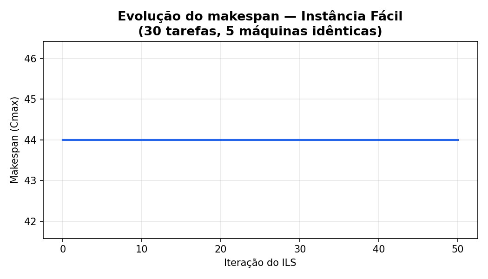
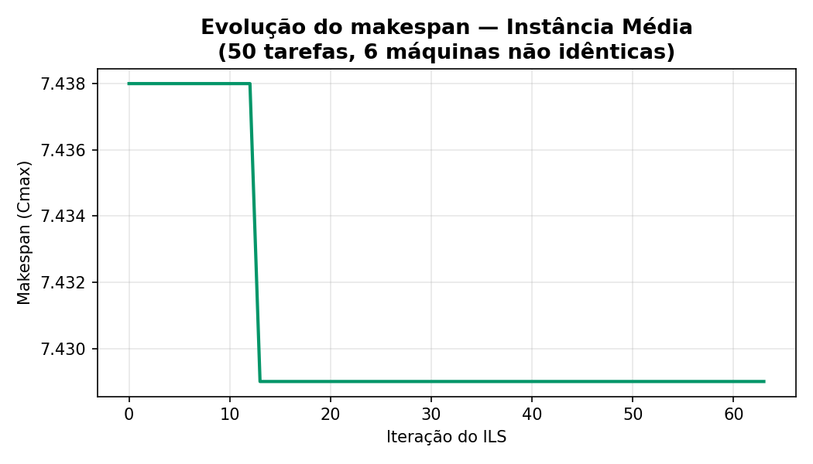
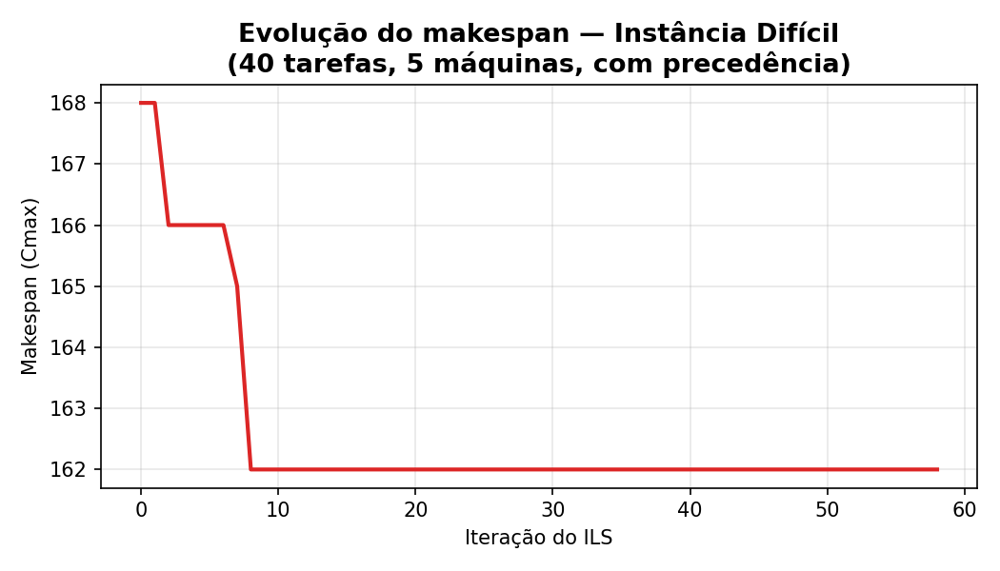

# Alocação de Tarefas em Máquinas Paralelas com Iterated Local Search (ILS)

Trabalho da disciplina de Inteligência Artificial — Exercício prático 2
(Metaheurísticas) — DCOMP/UFSJ.

Metaheurística implementada pelo aluno: Diego Resende Braz

---

## 1. O problema

O *Parallel Machine Scheduling* consiste em distribuir um conjunto de
tarefas entre um conjunto de máquinas, de forma a minimizar o **makespan**
(`Cmax`): o instante em que a última máquina termina de executar suas
tarefas. Cada tarefa é executada em exatamente uma máquina, sem
preempção (uma vez iniciada, não pode ser interrompida).

O exercício propôs três instâncias, com dificuldade crescente:

| Instância | Tarefas | Máquinas | Particularidade |
|---|---|---|---|
| Fácil    | 30 | 5 (idênticas)     | Tarefas independentes |
| Média    | 50 | 6 (não idênticas) | Máquinas com capacidades/velocidades diferentes |
| Difícil  | 40 | 5 (idênticas)     | Restrições de precedência entre tarefas |

Cada instância foi resolvida de forma independente, com seu próprio par
de arquivos `ils_maquinas_paralelas_<instância>.py` (código) e
`dados_maquinas_paralelas_<instância>.txt` (dados de entrada).

---

## 2. A metaheurística: Iterated Local Search (ILS)

O ILS explora o espaço de soluções alternando entre **busca local** (para
refinar uma solução até um ótimo local) e **perturbação** (para escapar
desse ótimo local e continuar a busca em outra região). A estrutura
segue o pseudocódigo apresentado em aula:

```
s0 ← SolucaoInicial()
s  ← BuscaLocal(s0)
iter ← 0 ; melhorIter ← iter ; nivel ← 1

enquanto (iter - melhorIter < ILSmax) faça
    iter ← iter + 1
    s'  ← Perturbacao(s, nivel)
    s'' ← BuscaLocal(s')
    se f(s'') < f(s) então
        s ← s''
        melhorIter ← iter
        nivel ← 1            # intensifica: perturbação volta a ser pequena
    senão
        nivel ← nivel + 1    # diversifica: perturbação cresce
    fim-se
fim-enquanto

retorne s
```

Componentes usados nas três instâncias:

- **Solução**: atribuição de cada tarefa a uma máquina.
- **SolucaoInicial (construção gulosa)**: as tarefas são processadas em
  ordem decrescente de tempo de processamento (regra **LPT — Longest
  Processing Time first**); cada tarefa é colocada na máquina em que
  termina mais cedo. É uma heurística clássica e rápida para
  *balanceamento de carga*.
- **BuscaLocal**: vizinhança de **realocação** — mover uma tarefa para
  outra máquina. A cada varredura, todas as combinações (tarefa, máquina
  destino) são avaliadas e a melhor melhoria é aplicada, repetindo até
  não haver mais ganho (*best improvement*).
- **Perturbação**: reatribuição aleatória de `nível` tarefas a máquinas
  aleatórias. O nível cresce quando a busca estagna (diversificação) e
  volta a 1 assim que uma melhora é encontrada (intensificação).
- **Critério de aceitação**: só aceita a nova solução se ela for
  estritamente melhor que a atual (`f(s'') < f(s)`).
- **Critério de parada**: `ILSmax` iterações consecutivas sem melhora
  (usado 50), com um limite de tempo de segurança.

### Adaptação por instância

| Instância | Como o makespan é calculado |
|---|---|
| Fácil   | `makespan = max(soma dos tempos das tarefas de cada máquina)` |
| Média   | capacidade tratada como **velocidade**: tempo real de uma tarefa na máquina *m* = `tempo_processamento / capacidade(m)`; makespan = maior carga (tempo real) entre as 6 máquinas |
| Difícil | não basta somar tempos: é feita uma **simulação** em ordem topológica (respeitando as precedências, com desempate por LPT); uma tarefa só começa quando a máquina está livre **e** todas as suas predecessoras terminaram |

---

## 3. Resultados

### 3.1 Instância Fácil (30 tarefas, 5 máquinas idênticas)

**a) Atribuição final:**

| Máquina | Tarefas | Carga |
|---|---|---|
| 1 | 4, 11, 26, 28, 29, 30 | 43 |
| 2 | 1, 3, 5, 7, 19, 25    | 44 |
| 3 | 10, 12, 15, 16, 17, 22 | 43 |
| 4 | 2, 6, 8, 9, 18, 20    | 43 |
| 5 | 13, 14, 21, 23, 24, 27 | 43 |

**b) Makespan final:** 44

**c) Tempo de execução:** 0,044 s (50 iterações do ILS)

**d) Evolução:**



A construção gulosa (LPT) já produziu uma solução muito equilibrada
(cargas entre 43 e 44). O ILS rodou as 50 iterações permitidas sem
encontrar nenhuma solução melhor — forte indício de que 44 é o valor
ótimo ou está muito próximo dele: a soma total dos tempos é 217, e o
limite inferior teórico é `⌈217 / 5⌉ = 44`, que é exatamente o valor
obtido.

---

### 3.2 Instância Média (50 tarefas, 6 máquinas não idênticas)

**a) Atribuição final:**

| Máquina | Capacidade | Tarefas | Carga (tempo real) |
|---|---|---|---|
| 1 | 18 | 1, 3, 7, 15, 26, 37, 50 | 7,167 |
| 2 | 22 | 18, 19, 22, 28, 30, 34, 35, 40, 47 | 7,409 |
| 3 | 25 | 13, 14, 16, 24, 25, 31, 36, 41, 42, 44 | 7,400 |
| 4 | 16 | 4, 5, 8, 10, 21, 39, 46 | 7,375 |
| 5 | 28 | 6, 9, 17, 20, 23, 27, 29, 32, 43, 48, 49 | 7,321 |
| 6 | 14 | 2, 11, 12, 33, 38, 45 | 7,429 |

**b) Makespan final:** 7,429

**c) Tempo de execução:** 0,475 s (63 iterações do ILS)

**d) Evolução:**



A construção gulosa chegou a 7,438; o ILS encontrou uma pequena melhora
(para 7,429) já na iteração 13, através de uma realocação de tarefa
entre máquinas, e manteve-se estável depois disso. Como as máquinas têm
velocidades diferentes, o "equilíbrio" ideal não é mais de soma de
tempos, e sim de tempo real — por isso as cargas parecem próximas
mesmo com quantidades de tarefas bem diferentes por máquina (a Máquina 6,
mais lenta, recebeu só 6 tarefas; a Máquina 5, mais rápida, recebeu 11).

---

### 3.3 Instância Difícil (40 tarefas, 5 máquinas idênticas, com precedência)

**a) Atribuição final (já na ordem de execução em cada máquina):**

| Máquina | Sequência de tarefas | Soma dos tempos | Término |
|---|---|---|---|
| 1 | 19, 1, 31, 28, 30, 24, 40 | 162 | 162 |
| 2 | 14, 7, 25, 32, 20, 2, 9, 36 | 157 | 162 |
| 3 | 10, 33, 3, 11, 26, 18, 6, 13 | 160 | 160 |
| 4 | 39, 27, 35, 17, 34, 23, 15, 16, 22 | 159 | 159 |
| 5 | 37, 12, 29, 5, 8, 38, 21, 4 | 154 | 154 |

**b) Makespan final:** 162

**c) Tempo de execução:** 0,776 s (58 iterações do ILS)

**d) Evolução:**



Esta foi a única instância em que a perturbação foi realmente decisiva:
o gráfico mostra o ILS escapando de sucessivos ótimos locais
(168 → 166 → 165 → 162) nas primeiras 8 iterações, e estabilizando em
162 pelo resto da execução. As 19 restrições de precedência fazem com
que o simples balanceamento de carga (que bastava nas instâncias fácil
e média) não seja suficiente: em alguns casos, uma tarefa precisa
esperar sua predecessora terminar em outra máquina, o que gera tempo
ocioso e torna o espaço de busca mais irregular — por isso a busca
local sozinha (a partir da construção gulosa) não bastou, e precisou
da perturbação do ILS para sair dos ótimos locais.

---

## 4. Comparativo geral

| Instância | Tarefas | Máquinas | Makespan | Tempo (s) | Iterações | Melhorou com a perturbação? |
|---|---|---|---|---|---|---|
| Fácil   | 30 | 5 | 44    | 0,044 | 50 | Não (construção já ótima/quase ótima) |
| Média   | 50 | 6 | 7,429 | 0,475 | 63 | Sim, pequena melhora (7,438 → 7,429) |
| Difícil | 40 | 5 | 162   | 0,776 | 58 | Sim, melhora significativa (168 → 162) |

---

## 5. Conclusões

- A qualidade da **solução construtiva** (LPT + máquina mais livre) tem
  grande impacto no resultado final: nas instâncias sem restrições
  adicionais (fácil e média), ela já entrega soluções muito próximas do
  ótimo, e a metaheurística serve principalmente para **confirmar** que
  não há como melhorar (fácil) ou fazer **ajustes finos** (média).
- Restrições de precedência (instância difícil) tornam o problema
  bem mais sensível à forma como as tarefas são distribuídas entre as
  máquinas, pois criam dependências temporais que a simples soma de
  cargas não captura. Foi nesse cenário que o **ILS mais se justificou**:
  a perturbação permitiu escapar de três ótimos locais sucessivos e
  reduzir o makespan em cerca de 3,6% (de 168 para 162).
- Em todos os casos, o algoritmo convergiu em **menos de 1 segundo**,
  o que mostra que o ILS é uma metaheurística leve e adequada para esse
  porte de instância (30 a 50 tarefas), permitindo, se necessário,
  aumentar `ILSmax` ou repetir a execução com sementes diferentes para
  buscar soluções ainda melhores a baixo custo computacional.
- O balanço entre **intensificação** (nível de perturbação volta a 1
  após melhora) e **diversificação** (nível cresce após estagnação) foi
  o que permitiu à instância difícil escapar dos ótimos locais sem
  precisar de uma perturbação forte demais logo no início, que
  arriscaria destruir uma boa solução parcial.

---

## 6. Arquivos do projeto

| Arquivo | Descrição |
|---|---|
| `ils_maquinas_paralelas_facil.py`   | Código do ILS para a instância fácil |
| `dados_maquinas_paralelas_facil.txt` | Dados de entrada da instância fácil |
| `ils_maquinas_paralelas_medio.py`   | Código do ILS para a instância média |
| `dados_maquinas_paralelas_medio.txt` | Dados de entrada da instância média |
| `ils_maquinas_paralelas_dificil.py` | Código do ILS para a instância difícil |
| `dados_maquinas_paralelas_dificil.txt` | Dados de entrada da instância difícil |
| `grafico_facil.png`, `grafico_medio.png`, `grafico_dificil.png` | Gráficos de evolução do makespan usados neste relatório |

Cada script é autocontido: basta executá-lo (`python3 nome_do_script.py`)
estando o respectivo arquivo de dados na mesma pasta.
